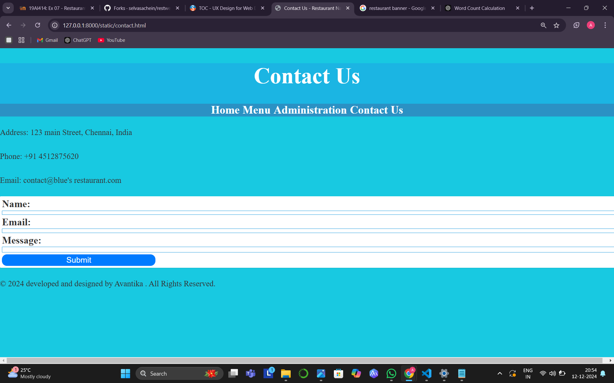

# Ex.07 Restaurant Website
## Date:12/12/24

## AIM:
To develop a static Restaurant website to display the food items and services provided by them.

## DESIGN STEPS:

### Step 1:
Requirement collection.

### Step 2:
Creating the layout using HTML and CSS.

### Step 3:
Updating the sample content.

### Step 4:
Choose the appropriate style and color scheme.

### Step 5:
Validate the layout in various browsers.

### Step 6:
Validate the HTML code.

### Step 7:
Publish the website in the given URL.

## PROGRAM:
<!DOCTYPE html>
<html lang="en">
<head>
    <meta charset="UTF-8">
    <meta name="viewport" content="width=device-width, initial-scale=1.0">
    <title>Restaurant Name - Home</title>
    <link rel="stylesheet" href="styles.css">
</head>
<body>
    <header>
        

            <h1>Welcome to Blue's kitchen: A multi-cuisine Franchise</h1>
            
The best place for delicious food and great memories!

            
        

        <nav>
            <ul>
                <li><a href="index.html">Home</a></li>
                <li><a href="menu.html">Menu</a></li>
                <li><a href="admin.html">Administration</a></li>
                <li><a href="contact.html">Contact Us</a></li>
            </ul>
        </nav>
    </header>
    <main>
        <section>
            <h2>About Us</h2>
            
We offer a wide variety of dishes made with fresh, locally and organically -sourced ingredients.take part on our journey and enjoy an unforgettable dining experience.

        </section>
    </main>
    <footer>
        
&copy; 2024 Designed and developed by Avantika. All Rights Reserved.

    </footer>
</body>
</html>
<!DOCTYPE html>
<html lang="en">
<head>
    <meta charset="UTF-8">
    <meta name="viewport" content="width=device-width, initial-scale=1.0">
    <title>Menu - Restaurant Name</title>
    <link rel="stylesheet" href="styles.css">
</head>
<body>
    <header>
        <h1>Menu</h1>
        <nav>
            <ul>
                <li><a href="index.html">Home</a></li>
                <li><a href="menu.html">Menu</a></li>
                <li><a href="admin.html">Administration</a></li>
                <li><a href="contact.html">Contact Us</a></li>
            </ul>
        </nav>
    </header>
    <main>
        

            

                
                <h3>lasanga</h3>
                
lasanga filled with a gooey cheese pull and finite mix of condiments including parsley

                
<strong>Price: ₹350</strong>

            

            

                
                <h3>man 'n'cheese</h3>
                
macaroni filled and baked with mozzarella

                
<strong>Price: ₹60</strong>

            

            

                
                <h3>nashville burger</h3>
                
thick patty with vegetables in between two soft buns covered in seasame seeds

                
<strong>Price: ₹45</strong>

            

            

                
                <h3>bao bao</h3>
                
bun steamed with filling of your choice

                
<strong>Price: ₹90</strong>

            

            

                
                <h3>chicken 65</h3>
                
chicken dipped in batter and deep fried

                
<strong>Price: ₹100</strong>

            

            

                
                <h3>prawn 65</h3>
                
prawn dipped in batter and deep fried

                
<strong>Price: ₹120</strong>

            

            

                
                <h3>pizza</h3>
                
thin crust covered in sauce and filled with cheese and toppings

                
<strong>Price: ₹600</strong>

            

            

                
                <h3>ramyeon</h3>
                
hand made noodles with authentic korean sauce

                
<strong>Price: ₹150</strong>

            

            

                
                <h3>ravioli</h3>
                
ravioli coated in sauce of your liking

                
<strong>Price: ₹90</strong>

            

            

                
                <h3>fried rice</h3>
                
rice sauted with vegetables and olive oil

                
<strong>Price: ₹75</strong>

            

            

                
                <h3>sushi</h3>
                
rice rolled into a balll with stuffing covered in seaweed

                
<strong>Price: ₹180</strong>

            

            

                
                <h3>spaghetti</h3>
                
pasta with sauce of your choice and meatballs

                
<strong>Price: ₹85</strong>

            

        

    </main>
    <footer>
        
&copy; 2024 designed and developed by Avantika. All Rights Reserved.

    </footer>
</body>
</html>
<!DOCTYPE html>
<html lang="en">
<head>
    <meta charset="UTF-8">
    <meta name="viewport" content="width=device-width, initial-scale=1.0">
    <title>Administration - Restaurant Name</title>
    <link rel="stylesheet" href="styles.css">
</head>
<body>
    <header>
        <h1>Administration</h1>
        <nav>
            <ul>
                <li><a href="index.html">Home</a></li>
                <li><a href="menu.html">Menu</a></li>
                <li><a href="admin.html">Administration</a></li>
                <li><a href="contact.html">Contact Us</a></li>
            </ul>
        </nav>
    </header>
    <main>
        

            

                
                <h3>ajay</h3>
                
owner

            

            

                
                <h3>kishore</h3>
                
manager

            

            

                
                <h3>mary</h3>
                
assistant manager

            

            

                
                <h3>shree</h3>
                
 head chef

            

            

                
                <h3>rahul</h3>
                
assistant chef

            

            

                
                <h3>priya</h3>
                
desk manager

            

            
        

    </main>
    <footer>
        
&copy; 2024 developed and designed by Avantika . All Rights Reserved.

    </footer>
</body>
</html>
body {
    font-size:200%
    font-family: Arial, sans-serif;
    margin: 0;
    padding: 0;
    background-color: #18c9e1;
    color: #333;
}

header {
    font-size: 700%;
    background-color: #1bb5e3;
    color: white;
    text-align: center;
    padding: 0rem 0;
}

h3 {
    font-size: 100px; 
    font-weight: bold; 
    text-align: center; 
    color: #333; 
}

nav ul {
    list-style: none;
    padding: 0;
    display: flex;
    justify-content: center;
    background-color: #2b91c4;
    margin: 0;
}

nav ul li {
    margin: 0 15px;
}

nav ul li a {
    text-decoration: none;
    color: white;
    font-weight: bold;
}

.banner {
    background: url('images/banner.jpg') no-repeat center center;
    background-size: cover;
    text-align: center;
    padding: 50px 0;
    color: white;
}

.menu-grid, .admin-grid {
    display: grid ;
    grid-template-columns: repeat(7, 10fr);
    gap: 20px;
    padding: 50px;
}

.menu-item, .admin-member {
    text-align: center;
    background-color: white;
    padding: 10px;
    border-radius: 5px;
    box-shadow: 0 2px 5px rgba(0, 0, 0, 0.2);
}

.menu-item, p {
        font-size: 500%; 
        line-height: 200%;
    }

    form {
        width: 100%;
        margin: 0 auto;
        background-color: #ffffff;
        padding: 20px;
        border-radius: 8px;
        box-shadow: 0 4px 8px rgba(0, 0, 0, 0.1);
    }
    
    label {
        font-size: 100px;
        font-weight: bold;
        display: block;
        margin-bottom: 8px;
    }
    
    input, textarea {
        width: 100%;
        padding: 10px;
        margin-bottom: 16px;
        border: 1px solid #1b99dd;
        border-radius: 4px;
    }
    
   button {
        background-color: #007BFF;
        color: white;
        padding: 10px 20px;
        border: none;
        border-radius: 50px;
        cursor: pointer;
    }

    .custom-button {
        width: 25%; 
        height: 100%; 
        font-size: 500%; 
    }

    button:hover {
        background-color: #0056b3;
    }
 <!DOCTYPE html>
<html lang="en">
<head>
    <meta charset="UTF-8">
    <meta name="viewport" content="width=device-width, initial-scale=1.0">
    <title>Contact Us - Restaurant Name</title>
    <link rel="stylesheet" href="styles.css">
</head>
<body>
    <header>
        <h1>Contact Us</h1>
        <nav>
            <ul>
                <li><a href="index.html">Home</a></li>
                <li><a href="menu.html">Menu</a></li>
                <li><a href="admin.html">Administration</a></li>
                <li><a href="contact.html">Contact Us</a></li>
            </ul>
        </nav>
    </header>
    <main>
        <section>
            
Address: 123 main Street, Chennai, India

            
Phone: +91 4512875620

            
Email: contact@blue's restaurant.com

        </section>
        <form action="#" method="POST">
            <label for="name">Name:</label>
            <input type="text" id="name" name="name" required>

            <label for="email">Email:</label>
            <input type="email" id="email" name="email" required>

            <label for="message">Message:</label>
            <textarea id="message" name="message" required></textarea>

            <button class="custom-button">Submit</button>

        </form>
    </main>
    <footer>
        
&copy; 2024 developed and designed by Avantika . All Rights Reserved.

    </footer>
</body>
</html>
   
    
## OUTPUT:

## RESULT:
The program for designing software company website using HTML and CSS is completed successfully.
